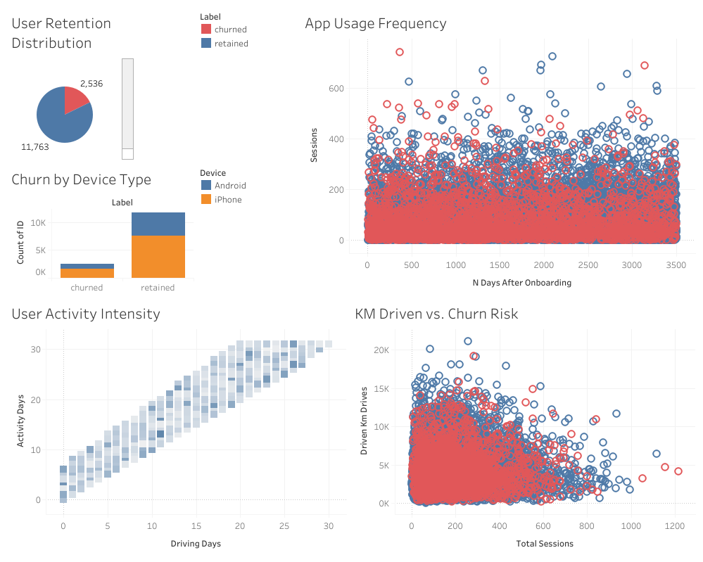
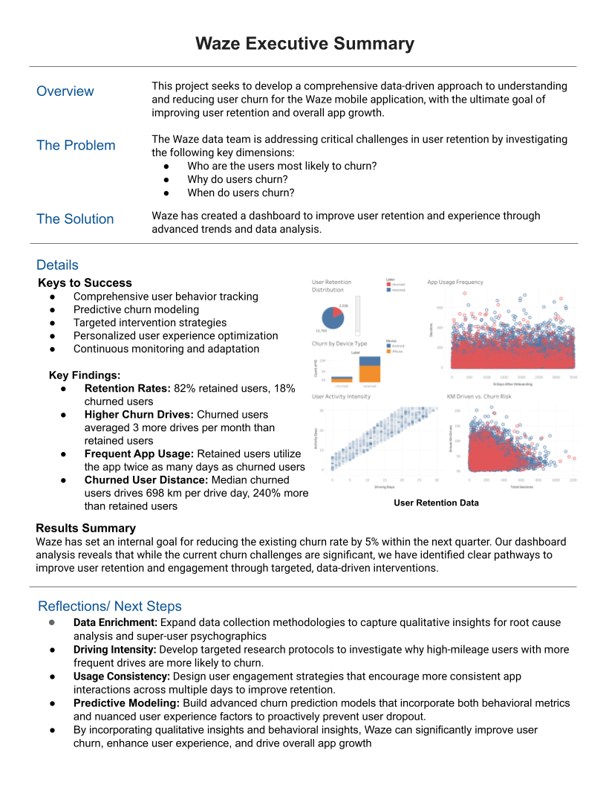
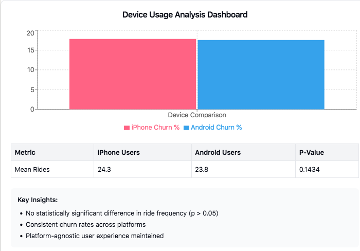
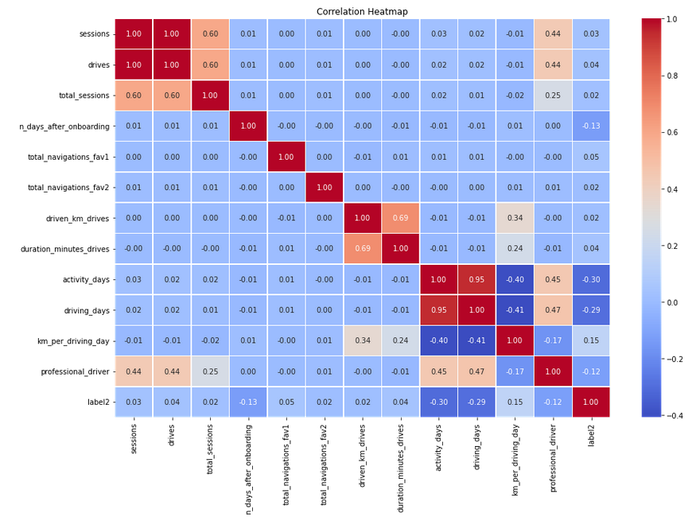
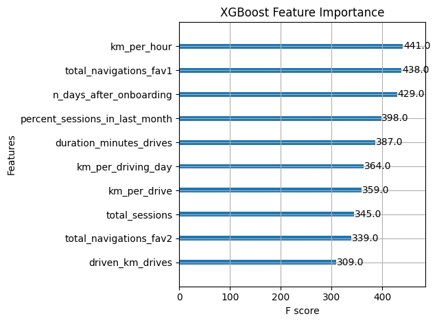
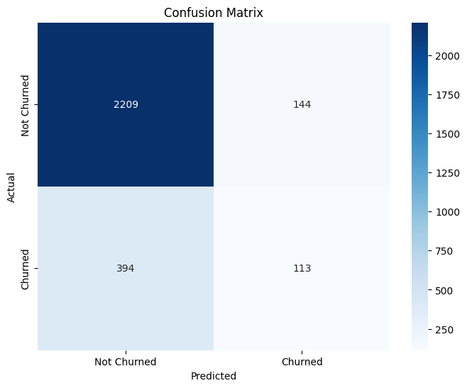

# Waze User Retention Analytics 🚘

**Waze User Churn Prevention Dashboard**  
This project enables data-driven insights for understanding and preventing user churn, focusing on optimizing user retention through behavioral pattern analysis.

### [Live Dashboard](https://public.tableau.com/app/profile/melissa.slawsky1925/viz/WazeUserRetentionData/Dashboard)

---

## Executive Summary & Key Findings 📄

---

### Strategic Insights: User Behavior Patterns 🔎

Our analysis revealed key patterns in user churn behavior:

1. **Usage Intensity (82% Retention vs. 18% Churn)**: ❤️‍🔥
   - **Churned Users**: Higher intensity (~3 more drives/month)
   - **Retained Users**: More consistent usage patterns
   - **Strategic Focus**: Balance between engagement and sustainability

2. **Activity Concentration (Key Metrics)**: ↕️
   - **Drive Patterns**: Churned users average 698km per driving day
   - **Time Distribution**: Retained users show 2x more active days
   - **Resource Focus**: Target high-intensity users with specialized features

3. **Platform Distribution**: ↔️
   - 64.48% iPhone users
   - 35.52% Android users
   - **Platform Impact**: No significant difference in churn rates

### Business Impact 💥
- **Goal**: Reduce user churn rate (currently 18%)
- **Potential Impact**: Target high-risk user segments
- **Resource Allocation Model**: Focus on user experience optimization

---

## Statistical Analysis: Device Impact on User Engagement 📊

### A/B Testing for Business Decision-Making 

We conducted hypothesis testing to determine if device type affects user engagement:

1. **Research Question**: 🔍
   - Is there a statistically significant difference in ride frequency between iPhone and Android users?
   - **Null Hypothesis**: No difference in mean rides between platforms
   - **Alternative Hypothesis**: Significant difference exists in mean rides

2. **Statistical Insights**: 📈
   - Two-sample t-test performed (p-value = 0.1434)
   - Failed to reject null hypothesis at α = 0.05
   - **Key Finding**: Device type does not significantly impact ride frequency

3. **Business Implications**: 💡
   - Platform-agnostic user experience successfully maintained
   - Resource allocation should focus on usage patterns rather than device-specific solutions
   - Consistent cross-platform performance validates current development approach

### Implementation Strategy 📋
- Develop retention strategies focusing on usage frequency rather than device type
- Maintain cross-platform consistency in future feature development
- Weight device type appropriately in churn prediction models

---

## Phase 2: Advanced Regression Analysis 🔬

### Project Overview
Following our initial exploratory analysis, we conducted a comprehensive binomial logistic regression model to predict user churn with greater precision.

### Model Performance 📊
- **Dataset Size**: 14,299 users
- **Model Accuracy**: 82.55%
- **Precision**: 54.44%
- **Recall**: 9.66%

### Key Insights from Regression Analysis 🧠

1. **Engagement Intensity**
   - Each additional day a user opens the app reduces churn risk by ~10%
   - **Strategic Recommendation**: Develop features encouraging daily app engagement (traffic updates, gas prices, road alerts)

2. **User Segmentation**
   - Professional Drivers: 7.6% churn rate
   - Non-Professional Drivers: 19.9% churn rate
   - **Strategic Recommendation**: Create segment-specific retention tactics

3. **Proactive Retention Strategies**
   - Develop an early warning system to identify at-risk users
   - Focus on enhancing features that demonstrate value during shorter, routine drives

---

## Phase 3: Advanced Machine Learning Models 🤖

### Project Overview
Building on our regression analysis, we developed and compared tree-based machine learning models to further improve churn prediction accuracy.

### Model Comparison Results 📊
| Model | Precision | Recall | F1 | Accuracy |
|-------|-----------|--------|----|---------| 
| Random Forest | 0.501428 | 0.105772 | 0.174212 | 0.822240 |
| XGBoost | 0.407280 | 0.183973 | 0.253176 | 0.807553 |
| Random Forest Validation | 0.446281 | 0.106509 | 0.171975 | 0.818182 |
| XGBoost Validation | 0.413934 | 0.199211 | 0.268975 | 0.808042 |
| XGBoost Test | 0.439689 | 0.222880 | 0.295812 | 0.811888 |

### Key Improvements
- **XGBoost Performance**: Successfully identified 22.3% of churning users (2.3x improvement over regression)
- **Precision-Recall Balance**: 44% precision ensures efficient targeting of at-risk users
- **Model Stability**: Consistent performance across validation and test sets

### Most Important Predictors
The XGBoost model identified these top factors influencing churn:
1. **Driving speed/efficiency** (km_per_hour)
2. **Navigation to favorite places** (total_navigations_fav1)
3. **User tenure** (n_days_after_onboarding)
4. **Recent engagement intensity** (percent_sessions_in_last_month)
5. **Time spent driving** (duration_minutes_drives)

### Feature Engineering Impact
Engineered features accounted for 6 of the top 10 predictors, highlighting the importance of domain knowledge in model development:
- **km_per_hour**: Driving efficiency metrics
- **percent_sessions_in_last_month**: Recent engagement intensity
- **km_per_driving_day**: Distance driven on active days
- **km_per_drive**: Average trip distance

### Confusion Matrix Analysis

| | Predicted Not Churned | Predicted Churned |
|---|---|---|
| **Actual Not Churned** | 2209 (True Negatives) | 144 (False Positives) |
| **Actual Churned** | 394 (False Negatives) | 113 (True Positives) |

Our model correctly identified 113 out of 507 churning users while maintaining a low false positive rate.

### Implementation Recommendations
1. Deploy the XGBoost model to score current users for churn risk
2. Implement targeted retention campaigns focused on:
   - Improving navigation efficiency and time-saving features
   - Encouraging setup and use of favorite destinations
   - Creating special engagement programs at critical tenure points
3. Monitor model performance monthly and refine as needed

### XGBoost Optimal Parameters

Our model performed best with these parameters:
- Learning rate: 0.2
- Max depth: 5
- Min child weight: 5
- Number of estimators: 300

---

### Next Steps 🚀
- Improve model predictive capability
- Conduct qualitative user research
- Develop personalized re-engagement strategies

---

## Project Documentation 📄

### Business Intelligence Documents 📑
- [Strategy Document](https://github.com/mslawsky/waze-user-analytics/raw/main/waze-strategy-doc.pdf) (PDF)
- [Project & Stakeholder Requirements](https://github.com/mslawsky/waze-user-analytics/raw/main/waze-project-requirements.pdf) (PDF)
- [EDA Results](https://github.com/mslawsky/waze-user-analytics/raw/main/waze-data-summary.pdf) (PDF)
- [Statistical Analysis Report](https://github.com/mslawsky/waze-user-analytics/raw/main/waze-statistical-report.pdf) (PDF)
- [Dashboard Mockup](https://github.com/mslawsky/waze-user-analytics/raw/main/waze-dashboard-mockup.png) (Image)
- [Regression Model Report](https://github.com/mslawsky/waze-user-analytics/raw/main/regression-model-report.pdf) (PDF)
- [Machine Learning Model Report](https://github.com/mslawsky/waze-user-analytics/raw/main/ml-model-report.pdf) (PDF)

### Data Analysis Process 📶

 **Data Files** 📂
- [Waze User Activity Data](https://github.com/mslawsky/waze-user-analytics/raw/main/waze_dataset.csv)
- [Churn Analysis Results](https://github.com/mslawsky/waze-user-analytics/raw/main/waze-data-summary1.png)
- [Platform Usage Patterns](https://github.com/mslawsky/waze-user-analytics/raw/main/waze-data-summary2.png)
- [Combined Analysis Results](https://github.com/mslawsky/waze-user-analytics/raw/main/waze-data-summary2.png)
- [Regression Analysis](https://github.com/mslawsky/waze-user-analytics/raw/main/waze-regression-analysis.png)
- [Feature Importance Analysis](https://github.com/mslawsky/waze-user-analytics/raw/main/feature-importance.png)
- [Confusion Matrix](https://github.com/mslawsky/waze-user-analytics/raw/main/confusion-matrix.png)

---

## Dashboard Development 📊

1. **Data Integration & Cleaning** 💾
   - Standardized user activity metrics
   - Validated data completeness (700 records with missing labels addressed)
   - Normalized driving metrics
   - Cross-referenced device data

2. **Metric Development** 📈
   - User Activity Patterns
   - Drive Intensity Metrics
     * Kilometers per drive
     * Drives per active day
     * Total activity days
   - Platform Usage Statistics
   - Churn Probability Indicators

3. **Visualization Strategy** 🖼️
   - User behavior pattern tracking
   - Cross-platform comparison
   - Temporal usage analysis
   - Churn risk indicators

4. **Statistical Analysis** 📉
   - Hypothesis test formulation
   - Descriptive statistics computation
   - Two-sample t-testing methodology
   - Statistical significance interpretation

5. **Machine Learning Integration** 🧮
   - XGBoost model integration for real-time churn probability
   - Feature importance visualization
   - Risk segmentation dashboard
   - Prediction accuracy monitoring

---

### Implementation Recommendations 📋

1. **Immediate Actions** ✅
   - Deploy XGBoost model to identify high-risk users
   - Develop targeted retention strategies focusing on driving efficiency
   - Encourage favorite destination setup for new users
   - Create re-engagement campaigns for users showing recent activity decline

2. **Resource Optimization** ➕
   - Implement features that improve navigation efficiency
   - Develop specialized engagement programs based on user tenure
   - Create features that enhance favorite place functionality
   - Focus on creating value for both professional and casual drivers

---

## Next Steps 🚀
- Enhance model with additional data sources
- Develop automated retention campaign system
- Create a user risk score API for integration with marketing tools
- Implement A/B testing framework for retention strategies
- Expand model to predict specific churn timeframes

---

## Contact ✉️

For inquiries about this analysis:
- [LinkedIn Profile](https://www.linkedin.com/in/melissaslawsky/)
- [Client Results](https://melissaslawsky.com/portfolio/)
- [Tableau Portfolio](https://public.tableau.com/app/profile/melissa.slawsky1925/vizzes)
- [Email](mailto:melissa@melissaslawsky.com)

---

© Melissa Slawsky 2025. All Rights Reserved.  
This repository contains proprietary analysis.

**Published Project URL**: [Waze User Retention Dashboard](https://public.tableau.com/app/profile/melissa.slawsky1925/viz/WazeUserRetentionData/Dashboard)

---

### Additional Technical Documentation 📄

1. **Python Analysis Notebooks**
   - [Initial Data Exploration](https://github.com/mslawsky/waze-user-analytics/raw/main/waze-project-lab.pdf) (PDF)
   - [User Behavior Analysis](https://github.com/mslawsky/waze-user-analytics/raw/main/waze-project-lab.py) (PY)
   - [Statistical Hypothesis Testing](https://github.com/mslawsky/waze-user-analytics/raw/main/waze-hypothesis-test.py) (PY)
   - [Churn Prediction Model - Regression](https://github.com/mslawsky/waze-user-analytics/raw/main/regression-model.ipynb) (IPYNB)
   - [Churn Prediction Model - Tree-Based Models](https://github.com/mslawsky/waze-user-analytics/raw/main/tree-models.ipynb) (IPYNB)

2. **Model Deployment Resources**
   - [XGBoost Model Implementation Guide](https://github.com/mslawsky/waze-user-analytics/raw/main/model-deployment.pdf) (PDF)
   - [Risk Score API Documentation](https://github.com/mslawsky/waze-user-analytics/raw/main/risk-score-api.md) (MD)
   - [Retention Campaign Integration](https://github.com/mslawsky/waze-user-analytics/raw/main/campaign-integration.pdf) (PDF)
